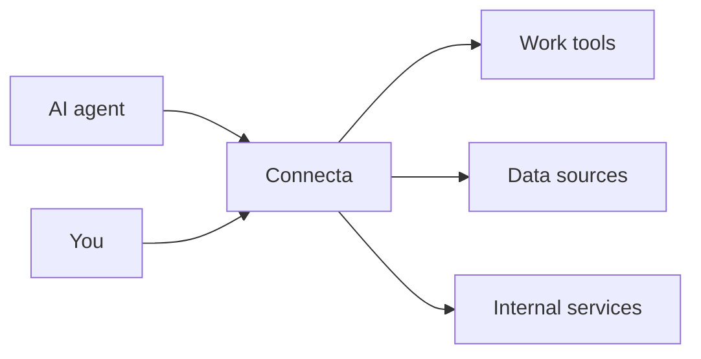

# connecta

One place for AI agents to connect to the tools you choose.

Connecta gives an agent a single MCP endpoint instead of making it connect to
every service separately. You decide which integrations are available,
Connecta keeps their credentials and connections in one place, and the agent
discovers what it needs as it works.

## Why Connecta

- **One connection.** Configure clients once, even as integrations change.
- **Less clutter.** Agents discover capabilities when needed instead of
  loading every tool up front.
- **Safer access.** Credentials stay server-side and consequential actions
  remain explicit.
- **Your deployment.** Connecta runs on Node, Docker, or Cloudflare Workers,
  with configuration you can review and version.

## Start here

- [Node example](./examples/node/)
- [Docker example](./examples/docker/)
- [Cloudflare Worker example](./examples/worker/)
- [Documentation](./documentation/)

Connecta is code-first: an agent writes ordinary JavaScript against the
integrations you chose, and a handful of explicit tools cover the jobs a program
is the wrong shape for. Deployments without a sandbox to run that code keep the
earlier tool-by-tool interface, which stays supported.

## Project status

Connecta is built for its author's deployments first and is still evolving.
Breaking changes are expected before 1.0.

Read the [ethos](./ethos.md) for the product's principles, the
[changelog](./CHANGELOG.md) for releases, and [security policy](./SECURITY.md)
for vulnerability reporting.
