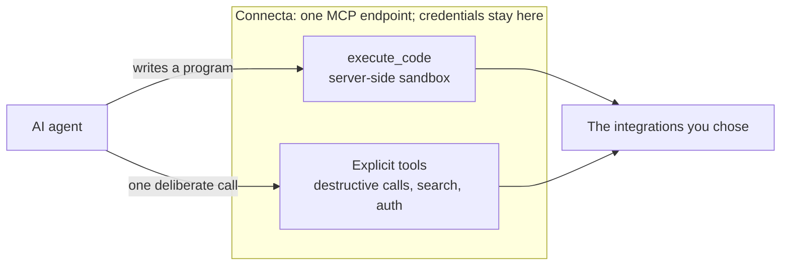

# connecta


One place for AI agents to connect to the tools you choose.

Connecta gives an agent a single MCP endpoint instead of making it connect to
every service separately. You decide which integrations are available and
Connecta holds their credentials, and the agent mostly works by writing
ordinary JavaScript that Connecta runs in a sandbox next to them — with a few
explicit tools for the jobs a program is the wrong shape for, destructive calls
among them.



## Why Connecta

- **One connection.** Configure clients once, even as integrations change.
- **Seven tools, not seven hundred.** A program can search the catalog, chain
  calls, and trim the results before the agent ever sees them — so nothing has
  to be loaded up front.
- **Safer access.** Credentials stay server-side — the program never sees them
  — and consequential actions remain explicit and individual.
- **Named client access.** A Clerk operator can issue and revoke one-time,
  hashed Bearer tokens for MCP clients that support header authentication.
- **Your deployment.** Connecta runs on Node, Docker, or Cloudflare Workers,
  with configuration you can review and version.

## Start here

Create the prescribed Node deployment:

```sh
npx @zackbart/connecta init my-connecta
cd my-connecta
npm install
CONNECTA_TOKEN=dev-token npm start
```

Point an MCP client at `http://localhost:8787/mcp` with
`Authorization: Bearer dev-token`. The generated project is deliberately small:

```text
my-connecta/
├── src/index.ts       # connectors, auth, storage, public URL
├── package.json       # exact Connecta and QuickJS versions
├── tsconfig.json
├── .env.example
├── .gitignore
├── AGENTS.md
├── CLAUDE.md -> AGENTS.md
└── README.md
```

For an agent setting this up, the contract is:

1. Edit `src/index.ts`; do not copy Connecta internals into the deployment.
2. Keep the required `executor: quickJsExecutor()` configuration; without an
   executor the deployment refuses to boot.
3. Keep secrets in environment variables or a secret store, never source.
4. Add connectors explicitly: import a maintained prebuilt provider
   constructor when one exists, otherwise write a deliberate `remoteMcp()` or
   `api()` connector. There is no registry to browse and nothing registers
   itself.
5. Run `npm run typecheck`, start the server, and run
   `CONNECTA_TOKEN=... npm run doctor`. Doctor checks health, the executor, and
   the exact seven-tool model-facing surface, then executes a harmless sandbox
   program. The bearer stays in the environment rather than command history.

The template refuses to merge into an existing directory, so initialization
cannot overwrite another project. Its generated programs have no filesystem,
environment, arbitrary network, imports, or timers; only explicitly read-only
connector tools are reachable. Unannotated or write-capable calls stay
individual and cross `call_destructive_tool`, where the MCP host can ask the
operator for approval.

Other supported deployment shapes:

- [Prescribed Node template](./templates/node/)
- [Node repository example](./examples/node/)
- [Code-first Docker deployment (repository-only)](https://github.com/zackbart/connecta/tree/main/examples/docker)
- [Cloudflare Worker deployment](./examples/worker/)
- [Subsystem documentation](./documentation/)

Every deployment configures a sandbox: QuickJS on Node or a Dynamic Worker on
Cloudflare. Construction fails with an actionable error when the executor is
missing, so the model-facing interface is always the same seven tools.

## Project status

Connecta is built for its author's deployments first and is still evolving.
Breaking changes are expected before 1.0.

Read the [ethos](./ethos.md) for the product's principles, the
[changelog](./CHANGELOG.md) for releases, and [security policy](./SECURITY.md)
for vulnerability reporting.
