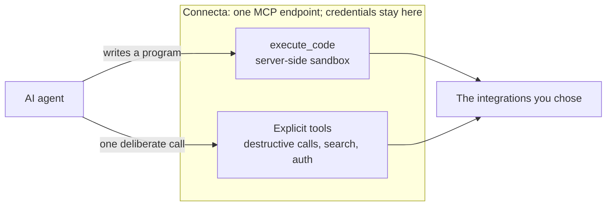

# connecta

One place for AI agents to connect to the tools you choose.

Connecta gives an agent a single MCP endpoint instead of making it connect to
every service separately. You decide which integrations are available and
Connecta holds their credentials, and the agent mostly works by writing
ordinary JavaScript that Connecta runs in a sandbox next to them — with a few
explicit tools for the jobs a program is the wrong shape for, destructive calls
among them.

## Why Connecta

- **One connection.** Configure clients once, even as integrations change.
- **Seven tools, not seven hundred.** A program can search the catalog, chain
  calls, and trim the results before the agent ever sees them — so nothing has
  to be loaded up front.
- **Safer access.** Credentials stay server-side — the program never sees them
  — and consequential actions remain explicit and individual.
- **Named client access.** A Clerk operator can issue and revoke one-time,
  hashed Bearer tokens for MCP clients that support header authentication.
- **Your deployment.** Connecta runs on Node, Docker, or Cloudflare Workers,
  with configuration you can review and version.

## Start here

- [Node example](./examples/node/)
- [Docker example](./examples/docker/)
- [Cloudflare Worker example](./examples/worker/)
- [Documentation](./documentation/)

Configuring a sandbox — a Dynamic Worker on Cloudflare, QuickJS on Node — is
what selects the code-first surface, and it is the assumed posture. A
deployment without one keeps the earlier nine-tool, call-by-call interface,
which stays supported.

## Project status

Connecta is built for its author's deployments first and is still evolving.
Breaking changes are expected before 1.0.

Read the [ethos](./ethos.md) for the product's principles, the
[changelog](./CHANGELOG.md) for releases, and [security policy](./SECURITY.md)
for vulnerability reporting.
