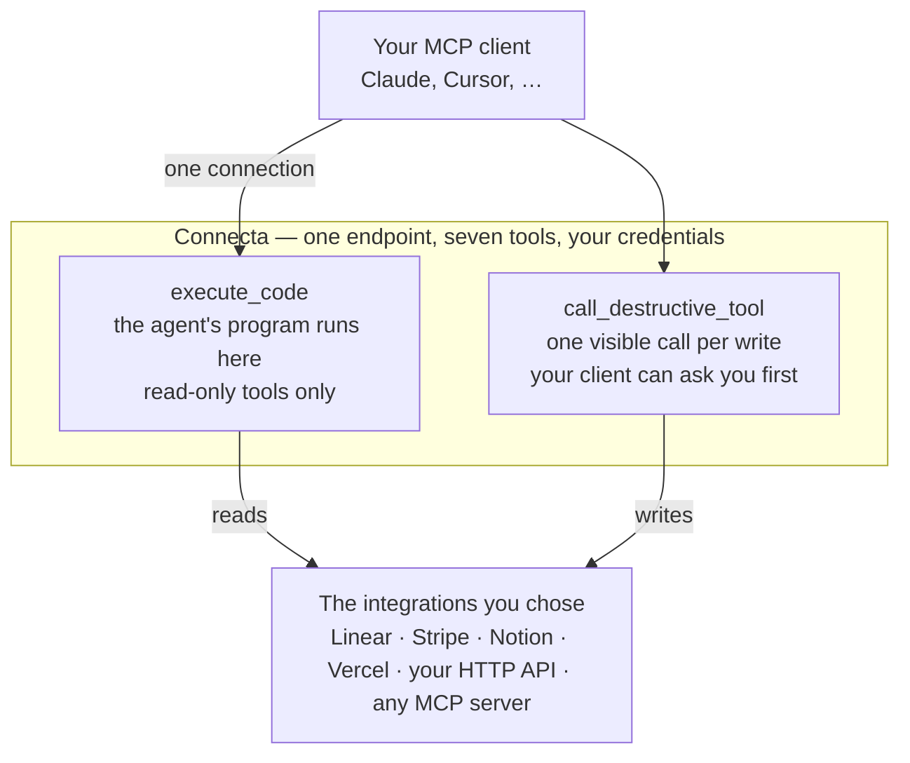

# connecta


One MCP endpoint. The integrations you chose. Your agent reaches them by
writing code instead of loading a thousand tool definitions.

## The mental model

You ask your agent a question that touches a service — Linear, Stripe, an
internal API, anything you have connected. Here is what happens:

1. The agent talks to one endpoint, yours, and sees seven tools. Always seven,
   no matter how many services sit behind it.
2. It writes a short JavaScript program. Connecta runs it in a sandbox next to
   your integrations. The program can search for tools, call them, chain the
   calls, and shape the result.
3. Only the answer comes back into the agent's context — not raw pages of
   API output.
4. If the agent wants to change something — create, update, delete — it
   cannot do that from a program. It makes one explicit call, and your MCP
   client can put that call in front of you first.

Credentials never leave the server. The program never sees them, and neither
does the agent.



This is the kind of thing the agent writes, not you:

```js
async () => {
  const { nodes } = await connecta.call("tracker.list_issues", { state: "started" });
  const byOwner = {};
  for (const issue of nodes) {
    (byOwner[issue.assignee?.name ?? "unassigned"] ??= []).push(issue.identifier);
  }
  return byOwner;
}
```

Fifty issues in, one small object out. Your context window notices.

## What you can do with it

- **Put every MCP server you use behind one connection.** Add or remove
  services in a config file; your client never changes.
- **Wrap any HTTP API by hand.** A few lines per tool. No OpenAPI conversion —
  generated tool sprawl is the problem, not the fix.
- **Use maintained connections** for Cloudflare, Linear, Mixpanel, Notion,
  RevenueCat, Stripe, and Vercel: known endpoints, auth defaults, and vetted
  read/write classifications, imported one at a time. Cloudflare, Notion, and
  Vercel each let the deployment choose their hand-written API interface or
  official hosted MCP.
- **Let the agent work in code.** Search, chain, filter, join, and reduce
  inside the sandbox instead of round-tripping every call through the model.
- **Teach undeclared result shapes by using them.** Successful read-only calls
  retain field names and broad types in bounded runtime memory, never scalar
  values, so later programs can project a remote MCP result its provider never
  documented.
- **Keep writes deliberate.** Only tools marked read-only run in a program.
  Everything else is a separate, visible call your client can gate.
- **Run it where you like.** Node, a Docker container, or a Cloudflare Worker,
  from the same small deployment file.

Deployments explicitly compose optional features: `operatorUi()` from
`@zackbart/connecta/ui`, `encryptedCredentialVault()` from `/credentials`,
`activityHistory()` from `/activity`, and inbound authentication adapters from
`/auth/*`. Omit a module and its implementation does no runtime work. Core
keeps connector discovery, execution, invocation, and enforcement together.

The optional UI shows each person's connections and effective permissions.
Authentication controls live inside each connection, with optional activity
history. The configured connection list loads before downstream checks finish;
a slow provider does not hold up the page. Connector selection and access rules
remain in deployment code.

One deployment may serve several authenticated people inside the same tenant.
Cloudflare Access supplies Worker identity; Node can use Clerk or the optional
configured bearer adapter. Connecta owns no accounts or groups and issues no
client access tokens. Shared-credential administration and personal connection
setup require separate explicit permissions, both denied by default. See
[inbound auth](./documentation/auth.md#principals-visibility-and-operators),
[shared and personal auth](./documentation/storage-and-credentials.md#shared-and-personal-auth),
and the [module migration guide](./documentation/upgrading.md#0240-optional-modules).

Connecta is not a platform, a marketplace, a policy engine, or a multi-tenant
service. Those are decisions, and the [ethos](./ethos.md) records each one
and why.

## Getting started

Setup is written for an agent. Point yours at [`AGENTS.md`](./AGENTS.md) and
ask it to set up a Connecta deployment; the
[documentation](./documentation/) covers every subsystem if you want to go
deeper, and [upgrading](./documentation/upgrading.md) an existing deployment
is its own runbook.

## Status

Built for its author's deployments first and published openly. Breaking
changes are expected before 1.0. See the [changelog](./CHANGELOG.md) and
[security policy](./SECURITY.md).
