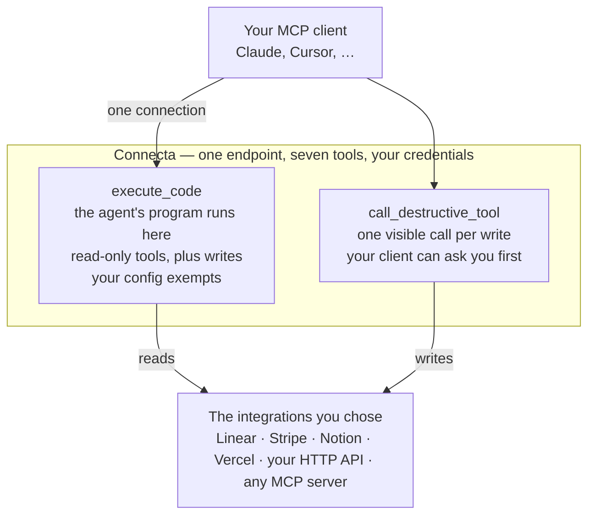

# connecta


One MCP endpoint. The integrations you chose. Your agent reaches them by
writing code instead of loading a thousand tool definitions.

## The mental model

You ask your agent a question that touches a service — Linear, Stripe, an
internal API, anything you have connected. Here is what happens:

1. The agent talks to one endpoint, yours, and sees seven tools. Always seven,
   no matter how many services sit behind it.
2. It writes a short JavaScript program. Connecta runs it in a sandbox next to
   your integrations. The program can search for tools, call them, chain the
   calls, and shape the result.
3. Only the answer comes back into the agent's context — not raw pages of
   API output.
4. If the agent wants to change something — create, update, delete — it
   cannot do that from a program, unless your config exempts that tool. The
   program refuses the write before anything is sent and hands back the exact
   call; the agent makes it through `call_destructive_tool`, one visible call
   your MCP client can put in front of you first.

Credentials never leave the server. The program never sees them, and neither
does the agent.


```mermaid
flowchart TB
    Client["Your MCP client<br/>Claude, Cursor, …"]

    subgraph Connecta["Connecta — one endpoint, seven tools, your credentials"]
        Sandbox["execute_code<br/>the agent's program runs here<br/>read-only tools, plus writes<br/>your config exempts"]
        Explicit["call_destructive_tool<br/>one visible call per write<br/>your client can ask you first"]
    end

    Integrations["The integrations you chose<br/>Linear · Stripe · Notion · Vercel · your HTTP API · any MCP server"]

    Client -->|"one connection"| Sandbox
    Client --> Explicit
    Sandbox -->|"reads"| Integrations
    Explicit -->|"writes"| Integrations
```

This is the kind of thing the agent writes, not you:

```js
async () => {
  const { nodes } = await connecta.call("tracker.list_issues", { state: "started" });
  const byOwner = {};
  for (const issue of nodes) {
    (byOwner[issue.assignee?.name ?? "unassigned"] ??= []).push(issue.identifier);
  }
  return byOwner;
}
```

Fifty issues in, one small object out. Your context window notices.

## What you can do with it

- **Put every MCP server you use behind one connection.** Add or remove
  services in a config file; your client never changes.
- **Wrap any HTTP API by hand.** A few lines per tool. No OpenAPI conversion —
  generated tool sprawl is the problem, not the fix.
- **Use maintained connections** for Basecamp, Breeze ChMS, Church Community
  Builder, Cloudflare, Gmail, Google Docs, Google Drive, Google Forms, Google
  Sheets, Google Slides, Linear, Mixpanel, Notion, Overflow, Planning Center,
  RevenueCat, Stripe, Tithe.ly, and Vercel: known endpoints, auth defaults, and
  vetted read/write classifications, imported one at a time.
  Cloudflare, Notion, and Vercel each let the deployment choose their
  hand-written API interface or official hosted MCP. Planning Center, Overflow,
  Tithe.ly, Breeze, and Church Community Builder are hand-written over their
  whole APIs, with every money-moving write behind approval. Gmail reads mail
  and writes drafts — never sends — and Google Drive reads, writes, and shares
  files — never deletes one for good — as each signed-in Workspace user through
  domain-wide delegation, with no per-user consent step; Google Docs reads and
  edits documents, and Google Sheets reads and writes spreadsheets, the same
  way. Google Slides reads, creates, edits, and comments on each user's decks the
  same way.
  Google Forms reads and edits forms and reads their responses the same way.
- **Let the agent work in code.** Search, chain, filter, join, and reduce
  inside the sandbox instead of round-tripping every call through the model.
- **Teach undeclared result shapes by using them.** Successful read-only calls
  retain field names and broad types in bounded runtime memory, never scalar
  values, so later programs can project a remote MCP result its provider never
  documented.
- **Keep large results usable.** Oversized direct calls return a bounded
  preview with a handle for paging through the rest. For read-only work, the
  notice also points the agent to reduce or search the result inside a
  program. Discovery can show compact schemas, exact JSON Schema, or a
  TypeScript signature to read while writing JavaScript.
- **Keep writes deliberate.** Only tools marked read-only run in a program.
  Every other write is a separate, visible `call_destructive_tool` call your
  client can gate, so the host's permission prompt is the one approval there
  is. Config — and only config — can exempt a cheap, reversible write from
  asking, per tool or per connector, and then a program may make it.
- **Run it on Node or Cloudflare Workers.** The core is shared; each deployment
  supplies its platform's executor and one store: a D1 database on Workers
  (`@zackbart/connecta/d1`), a SQLite file on Node (`@zackbart/connecta/sqlite`).
  The Node template also runs unchanged in Docker.

Deployments explicitly compose optional features: `operatorUi()` from
`@zackbart/connecta/ui`, `encryptedCredentialVault()` from `/credentials`,
`activityHistory()` from `/activity`, `artifacts()` from `/artifacts`, and
inbound authentication adapters from `/auth/*`. Omit a module and its implementation does no runtime work. Core
keeps connector discovery, execution, invocation, and enforcement together.
Both deployment shapes write configuration as `defineConfig((env) => …)`, with
each optional module a type-checked expression the environment switches on.
`createConnecta` validates it against one schema — an unknown option or an
unusable value refuses to boot — and `connecta.describeConfig()` returns a
secret-free snapshot of what the deployment runs with.

The optional UI shows each person's connections and effective permissions.
Authentication controls live inside each connection, with optional activity
history. The configured connection list loads before downstream checks finish;
a slow provider does not hold up the page. Connector selection and access rules
remain in deployment code. It also explains which tools can run in programs or
need approval, offers a fixed repair prompt for classified failures, and shows
client setup commands for the endpoints the signed-in person can use.

One deployment may serve several authenticated people inside the same tenant.
Cloudflare Access supplies Worker identity; Node uses Clerk for human auth. Machine clients use connecta-issued `cta_`
access tokens. The optional static bearer adapter remains available until its
Phase 3 retirement. Connecta owns no accounts or groups. Shared-credential administration and personal connection
setup require separate explicit permissions, both denied by default. See
[inbound auth](./documentation/auth.md#principals-visibility-and-operators).
Clerk deployments enable `aud_claim_enabled` and use resource-bound JWT or
opaque OAuth tokens by default. An explicit `allowedOAuthClientIds` list is a
fallback for unbound tokens from dedicated clients. Clerk session
tokens authenticate operator routes only; [Clerk auth](./documentation/auth.md#clerk-oauth-tokens-and-operator-sessions)
describes endpoint audience validation and the configuration migration.

Connecta is not a platform, a marketplace, a policy engine, or a multi-tenant
service. The [principles](https://github.com/zackbart/connecta/blob/main/PRINCIPLES.md)
state the goals and invariants; [decision records](https://github.com/zackbart/connecta/tree/main/decisions)
explain past choices.

## Getting started

Setup is written for an agent. Point yours at [`AGENTS.md`](https://github.com/zackbart/connecta/blob/main/AGENTS.md) and
ask it to set up a Connecta deployment; the
[documentation](./documentation/) covers the architecture, the seven tools,
code mode, and inbound auth if you want to go deeper. When upgrading an
existing deployment, each [changelog](./CHANGELOG.md) release opens with what
breaks and what a deployment can ignore.

## Status

Built for its author's deployments first and published openly. Breaking
changes are expected before 1.0. See the [changelog](./CHANGELOG.md) and
[security policy](./SECURITY.md).

### Existing client tokens

Upgrading from v0.23 does not require rotating managed `cta_…` tokens. Import
`accessTokens` from `@zackbart/connecta/auth/access-tokens`, replace the old
`accessTokens: true` with `accessTokens: accessTokens(storage)`, and keep the
same persistent storage namespace and identity/tool/pool grant rules. Enable
`identity.accessTokenManagement` only for the interactive operators who should
manage tokens. Records written by v0.23 and later move with the store: a 0.28
JSON state file migrates with `connecta migrate-state`, and a D1 table is
read as is. See the package's `documentation/auth.md` for the migration.
