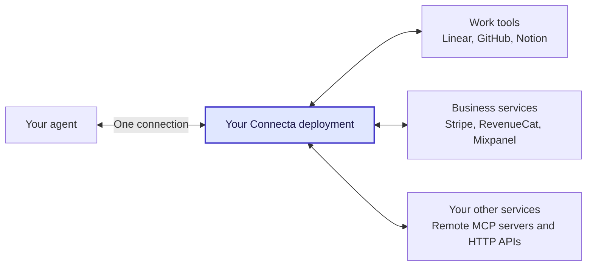
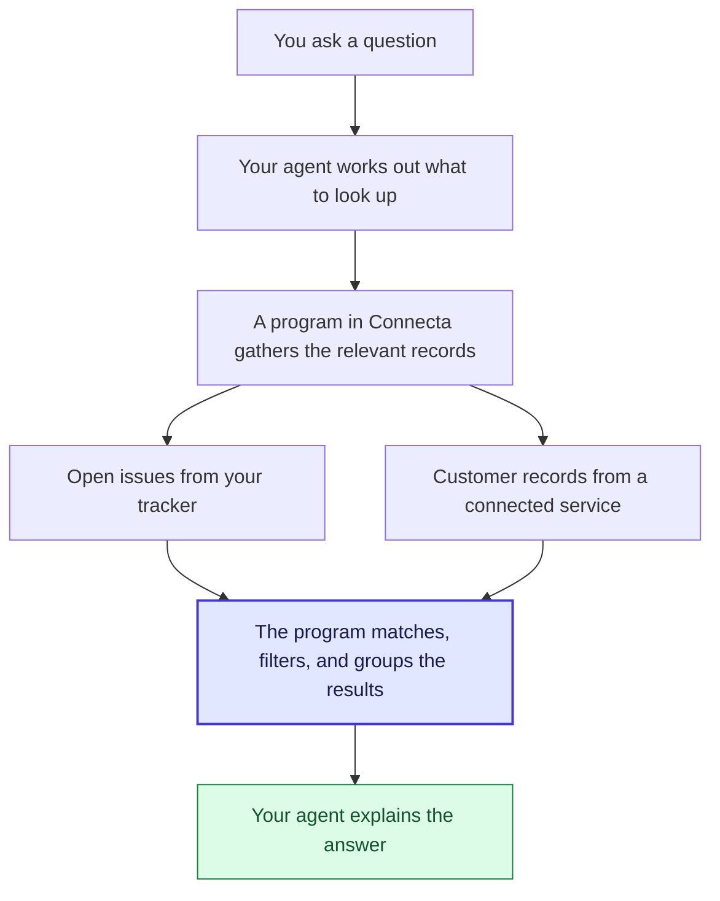
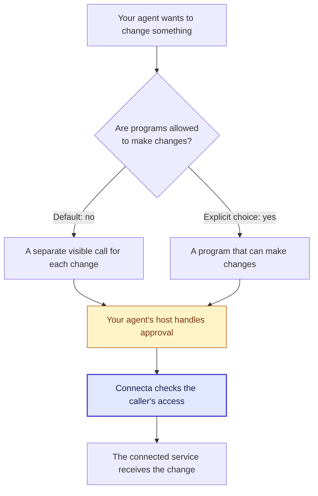

# connecta

One connection between your agent and the services you choose.

Connecta brings your MCP servers and HTTP APIs together behind one endpoint.
Connect your agent once, then choose which integrations it can use. You run
Connecta yourself, on your own machine or infrastructure.

## The mental model

Ask your agent to find open issues, compare them with customer feedback, or
prepare a report. Connecta gives it a small set of tools for finding and using
the services you connected, without loading every service's tool definitions
into the conversation.

The agent writes a short program that runs in a sandbox beside those
integrations. It can gather results, combine them, and return the parts that
answer your question. Fifty issues can become a short list grouped by owner
before the result reaches the conversation. The agent writes the code; you
ask for the work.

```mermaid
flowchart LR
    Agent["Your agent"] <-->|"One connection"| Connecta["Your Connecta deployment"]
    Connecta <--> Work["Work tools<br/>Linear, GitHub, Notion"]
    Connecta <--> Business["Business services<br/>Stripe, RevenueCat, Mixpanel"]
    Connecta <--> Yours["Your other services<br/>Remote MCP servers and HTTP APIs"]

    style Connecta fill:#e0e7ff,stroke:#4338ca,color:#1e1b4b,stroke-width:2px
```

You choose which services to connect and who can use them. Your agent keeps
the same connection as those services change.

## From a question to an answer

Say you ask, "Which open issues affect our highest-value customers?" Your agent
can gather information from your issue tracker and customer records, combine
it inside Connecta, and bring back a focused answer.

```mermaid
flowchart TB
    Question["You ask a question"] --> Plan["Your agent works out what to look up"]
    Plan --> Gather["A program in Connecta gathers the relevant records"]
    Gather --> Tracker["Open issues from your tracker"]
    Gather --> Customers["Customer records from a connected service"]
    Tracker --> Combine["The program matches, filters, and groups the results"]
    Customers --> Combine
    Combine --> Answer["Your agent explains the answer"]

    style Combine fill:#e0e7ff,stroke:#4338ca,color:#1e1b4b,stroke-width:2px
    style Answer fill:#dcfce7,stroke:#15803d,color:#14532d
```

The records are an example; the available information depends on the services
and access you have configured. Processing results inside Connecta keeps the
conversation focused on the answer.

## What you can do with it

Connect hosted MCP services, add an internal HTTP API, and let the agent work
across them in one task. Changing your connected services does not require
changing the agent's connection. Your deployment decides which services and
operations each caller can reach.

Connecta includes maintained connections for <!-- providers:start -->Basecamp, Breeze ChMS, Church Community Builder, Cloudflare, GitHub, Gmail, Google Docs, Google Drive, Google Forms, Google Sheets, Google Slides, Infisical, Linear, Mixpanel, Notion, Overflow, Planning Center, RevenueCat, Stripe, Tithe.ly, and Vercel<!-- providers:end -->.
Each connection has its own setup guide.
Stripe, Notion, Cloudflare, and Vercel use their hosted MCP servers when you
sign in with OAuth, and Connecta's own API connections when you use an API key,
a Cloudflare API token or Global API Key, a Notion integration token, or a
Vercel access token. You can also
connect other remote MCP servers or define the operations you need from an
HTTP API.

Google Workspace connections use the account your deployment assigns to each
signed-in person. A Workspace administrator authorizes them for your domain.
Gmail reads mail and writes drafts, but does not send mail. Google Drive can
read, write, and share files, but does not permanently delete them. Available
operations and account access depend on the integration and your deployment.

Large results need not fill the conversation. The agent can filter and
summarize them in its program, or read a large result in smaller pieces.

## Writes, credentials, and access

Connecta distinguishes reads from writes. By default, programs can read, and
each change uses a separate visible tool call. Your agent's host controls
whether it asks for approval. You can explicitly allow programs to make
changes too; the host then sees the program tool as a write. This choice does
not give a caller access to additional services.

```mermaid
flowchart TB
    Change["Your agent wants to change something"] --> Choice{"Are programs allowed<br/>to make changes?"}
    Choice -->|"Default: no"| Separate["A separate visible call for each change"]
    Choice -->|"Explicit choice: yes"| Program["A program that can make changes"]
    Separate --> Host["Your agent's host handles approval"]
    Program --> Host
    Host --> Access["Connecta checks the caller's access"]
    Access --> Services["The connected service receives the change"]

    style Host fill:#fef3c7,stroke:#b45309,color:#78350f
    style Access fill:#e0e7ff,stroke:#4338ca,color:#1e1b4b,stroke-width:2px
```

Connecta handles integration credentials on the server. Its sandbox does not
receive them. Optional encrypted storage protects saved credentials. Connections can use
shared credentials or a person's own account, with access rules set by the
deployment owner. Permission to use a connection is separate from permission
to manage its credentials.

People sign in through Clerk on Node or Cloudflare Access on Workers. Machine
clients use tokens issued by your Connecta deployment. A deployment can serve
several people within one tenant, each with the access you assign.

## A place to see your connections

The optional operator UI shows connected services, available tools, access,
and configuration. Authorized people can connect accounts, manage credentials,
and issue client tokens. Optional activity history shows who called what,
when, and whether it worked, without recording arguments, results, or program
code. The UI's controls follow the signed-in person's permissions.

Your agent or developer changes the integrations and access rules in deployment
code. The UI helps you inspect them and manage authentication.

## Where it runs

Run Connecta locally or on a server with Node, including in Docker, or host it
on Cloudflare Workers. Both offer the same agent tools. Running programs on
Workers requires Cloudflare's Workers Paid plan.

## Getting started

Give your agent the [agent documentation](./documentation/README.md) and ask it
to set up Connecta with the integrations you want. Tell it where you want to
run it and who should have access. The setup guides cover Node, Docker, and
Cloudflare Workers, including connecting your agent client.

For an existing deployment, ask your agent to follow the
[upgrade guidance](./documentation/deploying.md#upgrade-an-existing-deployment).

## Status

Built for its author's deployments first and published openly. Breaking
changes are expected before 1.0. See the [changelog](./CHANGELOG.md) and
[security policy](./SECURITY.md).

The [principles](https://github.com/zackbart/connecta/blob/main/PRINCIPLES.md)
state the goals and tested rules. [Decision records](https://github.com/zackbart/connecta/tree/main/decisions)
explain past choices. [GitHub issues](https://github.com/zackbart/connecta/issues)
track planned work; a plan is not a shipped feature.
